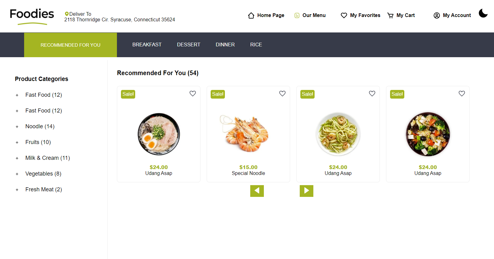
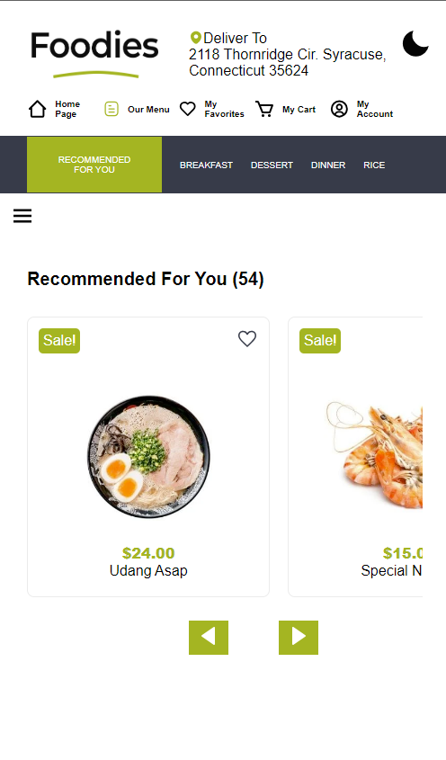
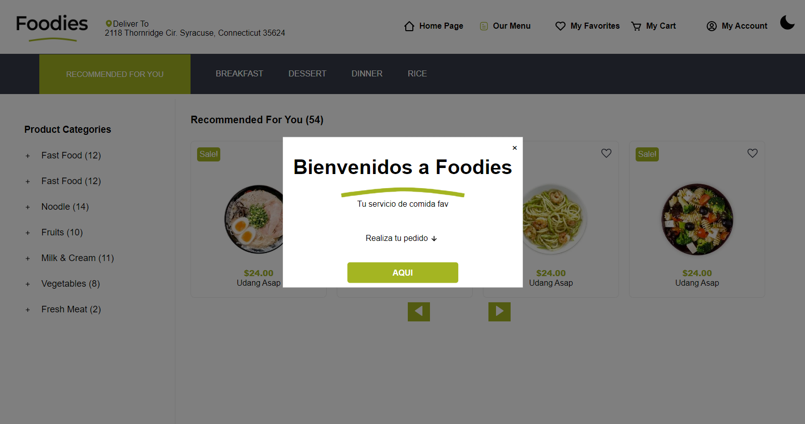

# Interfaz simple para servicio de comida Foodies
Este proyecto consiste en recrear el estilo frontend de una página de inicio que ofrece un servicio de comida. Se ha desarrollado con el objetivo de poner en práctica mis habilidades en el desarrollo web, utilizando principalmente Javascript para realizar diferentes funcionabilidades, como el modo oscuro, menu hamburgueza, ventana emergente y un Slider. La interfaz resultante no solo es visualmente atractiva, sino que también incluye diversas animaciones en sus componentes. Además, está diseñada para adaptarse a todo tipo de dispositivos, incluidos los móviles.

## 💻 Tecnologias:
- Css
- Html
- Javascript

No tiene ninguna funcionabilidad es solo elementos y estilos.
## 🖼 interfaz:

